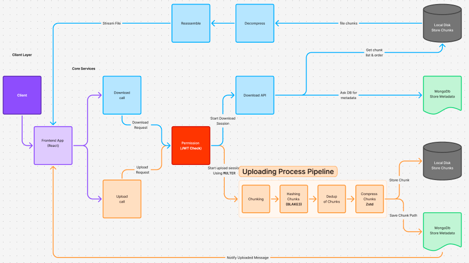

# ☁️ Cloud File Distribution System (CFDS)

A **chunk-based, deduplicated cloud file distribution system** that supports secure uploads, downloads, streaming-based file reconstruction, and efficient storage using content addressing.

Inspired by the design principles of modern distributed storage systems such as **Google File System (GFS)** and **object storage platforms like S3**, this project is implemented as a full-stack, production-style system.

---

## 🚀 Key Features

- 🔐 JWT-based Authentication & Authorization
- 🧩 Fixed-size File Chunking
- 🔑 SHA-256 Content Addressing
- ♻️ Chunk-level Deduplication
- 🗜 Gzip Compression for Storage Efficiency
- 📥 Streaming-based File Download
- 👁 In-browser File Viewing
- 🔗 Shareable File Links
- 🗑 Reference-counted Safe Deletion
- 📁 Metadata-driven File Management
- 🎨 Modern Google Drive–style UI
  
## System Architecture
The system follows a **modular, service-oriented architecture** where metadata is treated as the single source of truth and disk is treated as dumb storage.

## Architecture Overview

### Client (Web Browser)
- Built using **EJS + Tailwind CSS**
- Handles uploads, browsing, viewing, sharing, and downloads
- Communicates only with authenticated backend routes

---

### API Gateway (Express.js)
- Single entry point for all requests
- Responsible for:
  - **JWT** validation
  - Authorization via middleware
  - Request routing to services

---

### Authentication Service
- Stateless JWT-based authentication
- Manages user registration, login, and logout
- Protects all file-related routes

---

### Upload Service

Implements the complete upload pipeline:

*File → Chunk → Hash → Deduplicate → Compress → Store*

Responsibilities:
- Splits files into fixed-size chunks
- Computes **SHA-256** hash for each chunk
- Deduplicates chunks using hash lookup
- Compresses chunks using gzip
- Stores chunks on disk
- Persists file metadata and chunk references in MongoDB

---

### File Metadata Service (MongoDB)
Stores:
- File ownership
- Original filename
- File size & timestamps
- Ordered list of chunk hashes
- Reference counts for safe deletion

Acts as the **source of truth** for:
- Authorization
- File visibility
- File reconstruction

---

### Download & View Service
- Streams chunks sequentially from disk
- Decompresses data on the fly
- Reconstructs files without loading them fully into memory
- Supports:
  - Direct download
  - In-browser preview (view mode)

---

### Chunk Storage (Local Disk)
- Stores only compressed chunk data
- Organized using hash-prefix directories
- Contains no metadata or access logic
- Accessed only through backend services

---

## 🔁 Upload Lifecycle

**INIT → UPLOADING → COMMITTED**

- Files become visible only after successful commit
- Prevents partial or corrupted uploads

---

## 🗑 Deletion & Deduplication Strategy

- Files reference chunks by hash
- Each chunk maintains a `refCount`
- On file deletion:
  - `refCount` is decremented
  - Chunk is deleted from disk only when `refCount = 0`
- Enables safe, storage-efficient deduplication

---

## 🧩 Design Principles

- Metadata is the source of truth
- Disk is treated as dumb storage
- Content-addressed storage using SHA-256
- Streaming over buffering for scalability
- Strict access control via authentication middleware
- Clean separation of concerns
- Extensible and scalable architecture

---

## 🛠 Tech Stack

| Layer | Technology |
|------|-----------|
| Backend | Node.js, Express.js |
| Database | MongoDB |
| Authentication | JWT, Cookies |
| Storage | Local Disk (chunk-based) |
| Compression | gzip (zlib) |
| Frontend | EJS, Tailwind CSS |
| Upload Handling | Multer |

---

## 📌 Why This Project Matters

This is **not a CRUD MERN app**.

It demonstrates:
- Systems-level thinking
- Storage internals & content addressing
- Deduplication & compression strategies
- Streaming-based file reconstruction
- Secure, production-style backend design

---

## 🧭 Future Enhancements

- Object storage backend (S3 / MinIO)
- Background garbage collection
- File versioning
- Folder hierarchy
- Chunk replication
- Distributed workers
- Full-text search on metadata

---

## 📄 License

MIT

---

### 🏁 Final Note

This project represents a **foundational cloud storage system** built from first principles, focusing on correctness, efficiency, and extensibility.

